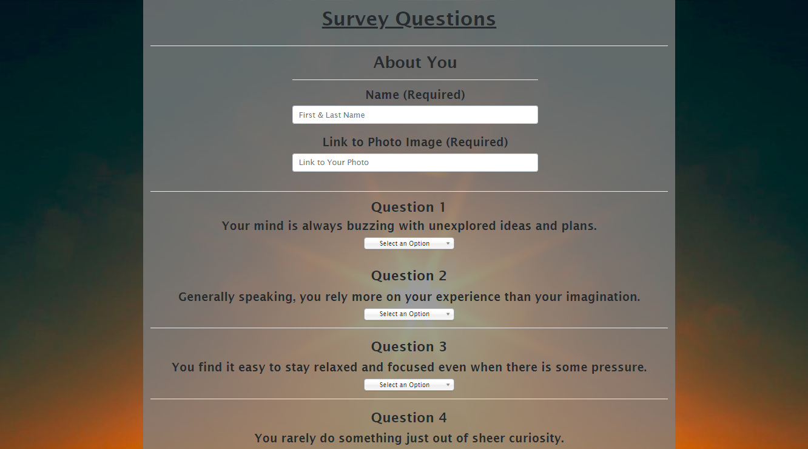
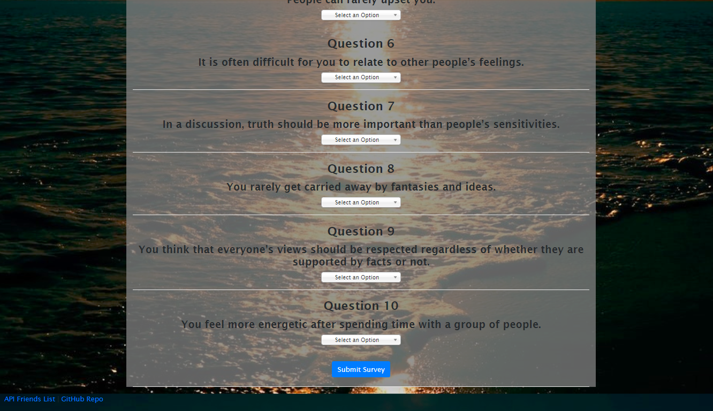

# Friend Finder - Node and Express Servers

### Overview

For this project, I have built a compatibility-based "FriendFinder" application -- basically a dating app. This full-stack site will take in results from your users' surveys, then compare their answers with those from other users. The app will then display the name and picture of the user with the best overall match. 

I am utilizing Node & Express to handle the routing. My front end is built with some CSS styling and Bootstrap Framework. This application is hosted on a Heroku server in turn effective creating my own API. Enjoy the application!

### How Friend Finder works

* To launch Friend Finder, click here (https://blooming-reef-29497.herokuapp.com/).

This site opens up to a home page which greets you and relays the goal of the survey to the user. 

Once the user clicks the button to begin the survey, the user is directed via routing, to the survey page. RESTful API methods are folowed. The user adds their name, a link to the photo of themselves, and answer a 10 question survey. The answers to the survey are numbered 1 - 5. (5 meaning that the user is in most agrement with the posed question.) 

Once the user completes the form in it's entirity. The information is compared against all other user inputs stored in the database. The application compares the answers that the user inputs, question by question, using the absolute value to ensure no negitive numbers are returned. The user's inputs are calculated and final number is derived - based on these calculations a match is determined.

Once a match has been determined, a modal card pops up with the photo and name of the best match for the current user! 

**photo of modal to come

## Technologies used

* Node.JS
* Express.JS
* Javascript
* Jquery
* Bootstrap
* RESTful API

